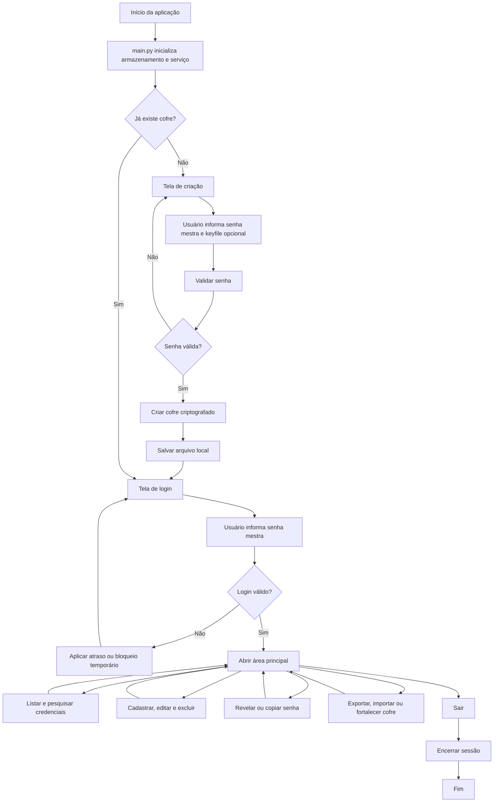

# Fluxograma Simples

Fluxograma de visão geral do projeto **Cofre de Senhas Seguro**.

```mermaid

flowchart TD
    A[Início da aplicação] --> B[main.py inicializa armazenamento e serviço]
    B --> C{Já existe cofre?}

    C -- Não --> D[Tela de criação]
    D --> E[Usuário informa senha mestra e keyfile opcional]
    E --> F[Validar senha]
    F --> G{Senha válida?}
    G -- Não --> D
    G -- Sim --> H[Criar cofre criptografado]
    H --> I[Salvar arquivo local]
    I --> J[Tela de login]

    C -- Sim --> J[Tela de login]

    J --> K[Usuário informa senha mestra]
    K --> L{Login válido?}
    L -- Não --> M[Aplicar atraso ou bloqueio temporário]
    M --> J
    L -- Sim --> N[Abrir área principal]

    N --> O[Listar e pesquisar credenciais]
    N --> P[Cadastrar, editar e excluir]
    N --> Q[Revelar ou copiar senha]
    N --> R[Exportar, importar ou fortalecer cofre]
    N --> S[Sair]
    O --> N
    P --> N
    Q --> N
    R --> N
    
    S --> T[Encerrar sessão]
    T --> U[Fim]
```
